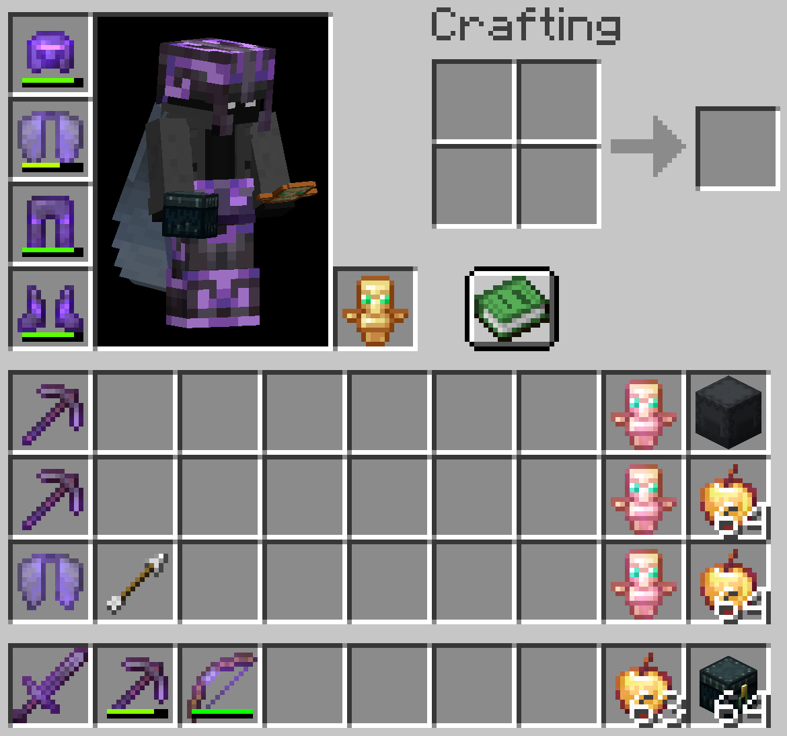

# Plane Builder Quickstart

This is the fast setup for running `plane-builder` on 6b6t. Bring backups, expect server lag, and start with a clean inventory.

## Requirements

- Minecraft `1.21.8`
- Java `21`
- Fabric Loader
- Meteor Client
- Baritone for Meteor
- WMBot installed as a Meteor addon

Install WMBot one of two ways:

- Download the latest jar from the [GitHub Releases page](https://github.com/watchmen-mod/wmbot/releases).
- Or build WMBot yourself:

```sh
./gradlew build
```

Put the WMBot jar and the Baritone for Meteor jar in your Minecraft `mods` folder. Meteor Client should be in that same folder too.

If you build from source, use the remapped WMBot jar from `build/libs`.

## Starting Inventory

Use this as a solid starting inventory. The bot can recover from some problems, but it works best with clean supplies and a little empty space.



**Important: the screenshot is missing loose obsidian. Put loose obsidian in your inventory before starting `plane-builder`; the bot needs loose obsidian to begin the build process.**

Recommended loadout:

- Full armor.
- Elytra equipped or ready if you plan to use `auto-elytra-fly`.
- Totems in inventory and offhand.
- Golden apples for Meteor Auto Eat.
- Loose obsidian to start the build process.
- Multiple non-Silk Touch pickaxes.
- Bow with arrows.
- Ender chest.
- Obsidian supply shulkers, or access to a kitbot that can deliver them.
- A little empty inventory space so refill and cleanup can actually work.

## Enable The Module

Open Meteor, go to the `WMBot` category, and enable:

- `plane-builder`

The bot builds an obsidian plane at Y `319`. It scans nearby placement targets, places obsidian, and replenishes when supplies get low.

## Defaults You Can Usually Leave Alone

`plane-builder` enables its companion modules by default while it is active:

- `auto-totem`
- `auto-eat`
- `velocity`
- `instant-rebreak`
- `kill-aura`

`hole-escape` is also enabled by default. Leave it on so the bot can path out if it gets boxed into a one-block hole.

`trash-hole-cleanup`, `pickaxe-durability-threshold-percent`, and `enderman-look-safety` are also set up with sane defaults.

## Options You Should Turn On

These are not all enabled by default because they depend on your route, your supplies, and whether you trust your kitbot setup.

### Auto Walk

Enable:

- `auto-walk`

This lets Baritone walk the plane route when there is no nearby placeable target. If you want the bot to keep moving instead of just building around where it stands, turn this on.

### Auto Elytra Fly

Optional, but useful for long gaps or gross terrain:

- `auto-elytra-fly`

Only use it if you have an elytra equipped and you are comfortable letting the bot do low flight during auto-walk.

### Kitbot Refill

Enable if you have access to a kitbot that can deliver ender-chest supplies:

- `kitbot-refill`

Check these settings before trusting it:

- `kitbot-nickname`
- `kitbot-kit-name`
- `kitbot-kit-count`
- `kitbot-whisper-command`
- `kitbot-teleport-accept-command`

Default kitbot refill settings target `whoahbuddy` and request `the watchmen's echest's`. Change those if your group uses a different kitbot or kit name.

If you do not have access to someone else's kitbot, host your own with the `stash-kitbot` module. Get your stash scanned/cache-ready first, then let `stash-kitbot` handle allowlisted whispers and deliveries.

### Bow Defense

Enable:

- `bow-defense`

This lets the bot use guarded bow behavior while idle or in safe replenish phases. Bring a usable bow and arrows.

## Recommended Startup Flow

1. Log into 6b6t and get to the place you want to build from.
2. Put on armor, totem, and elytra if using flight.
3. Match the starting inventory above as closely as possible.
4. Open Meteor > `WMBot` > `plane-builder`.
5. Turn on `auto-walk`.
6. Turn on `auto-elytra-fly` only if you actually want flight.
7. Turn on `kitbot-refill` only if the kitbot settings are correct.
8. Turn on `bow-defense`.
9. Confirm `hole-escape` is enabled.
10. Enable `plane-builder` and watch the first minute to catch setup problems early.

## If It Acts Weird

- No movement: make sure Baritone for Meteor is installed and `auto-walk` is enabled.
- No flight: make sure `auto-elytra-fly` is enabled and an elytra is available.
- No refill: check `kitbot-nickname`, `kitbot-kit-name`, and whether the kitbot is actually available.
- No eating: make sure Meteor Auto Eat exists, `auto-eat` is enabled in companion modules, and you have golden apples.
- No bow shots: make sure `bow-defense` is enabled, the bow is usable, and arrows exist.
- Stuck in a hole: leave `hole-escape` on.

Watch the `plane-builder-stats` HUD if you want live status without opening the module screen every five seconds.
